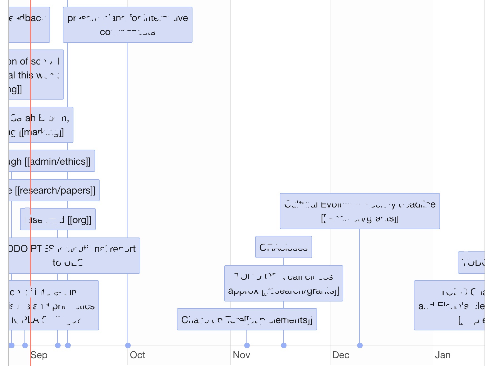

# logseq_timeline

An R Shiny App for visualising timelines in Logseq

# Design

The script scans your entire vault and reads every file. It uses Regexes to identify any event which is scheduled / has a deadline, i.e. date is in the format <2021-08-07>. It is thus computationally quite intensive, but seems to be very quick for small vaults.

# Ussage

Place the .R file in your logseq vault and run. For this to work you need "R" installed, and preferably "RStudio". You need to install the following packages in R for this to work:

`shiny` `timevis` `tidyverse` and `tools`

# Output

The output will look like this...

You can zoom in and scroll from left to right. Labels will adapt to fit the window.

# Possible roadmap

- Categorising events according to backlinks, and showing different categories in different lines
- Colouring events according to categories
- Making it more interactive, so that the user can select events from different categories.